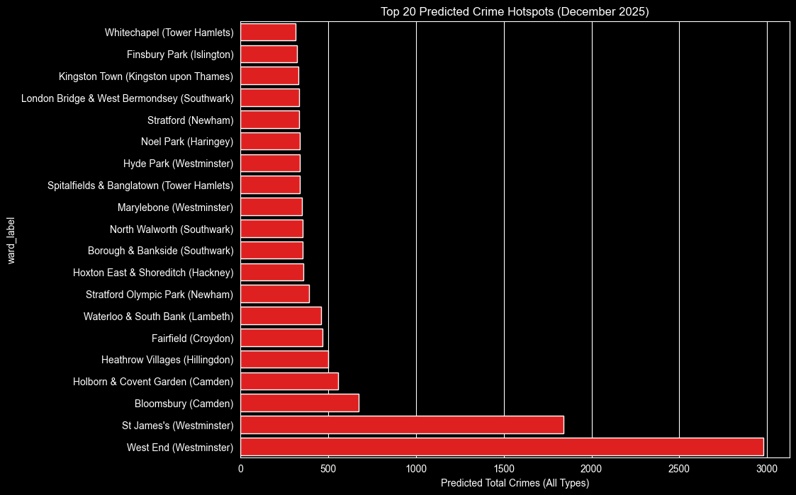

# London Crime Hotspot Prediction



> **Interactive map:** open [`reports/maps/london_hotspots.html`](reports/maps/london_hotspots.html)
> in any browser, hover any ward to see predicted vs actual crime counts.

---

## What this project does

Crime data published by UK police forces says where a crime happened (at a
deliberately blurred location) and which month it was recorded. It doesn't
say what will happen next month. This project trains a model that, given a
ward's recent history and its place in London, predicts how many crimes of
each type will occur there in the following month.

This is the kind of forecast that informs:
- Resource allocation by borough commanders
- Insurance premium adjustments by area
- Council decisions on lighting, CCTV, and patrol planning
- Property-tech safety scoring (Zoopla, Rightmove, etc.)

The model and the map are produced by a fully reproducible pipeline that runs
end-to-end on a modest laptop in roughly 15 minutes.

## Results

The model was evaluated on a strict chronological holdout. The last four
months of 2025 (September through December), which the model never saw during
training or model selection.

| Model | MAE | RMSE | MAE vs naive | RMSE vs naive |
|---|---|---|---|---|
| Naive baseline (predict last month) | 4.34 | 7.81 | — | — |
| **Random Forest (final model)** | **3.73** | **7.20** | **+14.0%** | **+7.8%** |
| XGBoost (Poisson objective) | 3.67 | 8.39 | +15.5% | −7.3% |

Why Random Forest, not XGBoost? XGBoost has a marginally lower MAE, but
its RMSE is worse than the naive baseline. RMSE penalises large errors more
heavily than MAE; the gap between the two metrics is real evidence that
XGBoost is making meaningfully bigger occasional misses. For a hotspot
forecaster, where one very wrong prediction is worse than several mildly wrong
ones, Random Forest's reliability advantage outweighs XGBoost's 1.5% MAE
edge. Picking on MAE alone would have selected the worse model.

## How it works

The pipeline runs across eight numbered notebooks.

1. Data profiling: 48 raw CSVs (24 months and 2 Police Forces (Metroplitan & City of London).
2. Cleaning: Dataset of 2.3M crimes cleaned
3. EDA: Temporal, categorical, and spatial structure explored. 
4. Spatial Join: Every crime point assigned to its official ward via
   geopandas point-in-polygon join against ONS boundary data.
5. Aggregation: 2.3M crimes collapsed into a ward × month × crime-type
   count table. A vital step here is explicit zeros. Every
   ward-month-type combination with no crime is added back as a literal 0.
   Without this, the model never learns what quiet looks like and would
   systematically over predict.
6. Feature engineering: Lag features built. 1 month ago, 2 months ago, 3 months ago
   and 12 months ago along with 3 month rolling mean and calendar features.
7. Modelling: Naive baseline → Random Forest → XGBoost.
8. Hotspot map: Predictions joined back onto ward polygons; interactive
   Folium choropleth saved as standalone HTML.

Each notebook ends with a written summary explaining what it did, what it
found, and what it decided.

## Methodology choices worth highlighting

These are the decisions a reviewer should look at if they want to know how
serious the work is.

**Chronological train/test split, not random k-fold.** For forecasting,
random splits leak future months into training and produce inflated metrics
that collapse in production. The split is by date: train through August 2025,
test on September–December 2025. The model never sees a single row from the
test period until final evaluation.

**Leak-free lag features.** Every lag uses `shift(n)` *inside* a
`groupby(ward, type)`, which structurally cannot pull values from later rows.
The notebook includes a runnable `assert` that checks `lag_1` equals the
previous month's count for a sample series. If the assertion fails, the
notebook halts — guaranteed-correct, not assumed-correct.

**Density-thresholded scoping.** The 14 standard crime categories were
filtered to the 10 with at least 5 incidents per ward-month on average, then
each retained type's zero-fraction was verified to confirm forecastability.
Rare types (Possession of Weapons, Bicycle Theft, Robbery, Other Crime) were
excluded because their ward-months are dominated by near-random zeros that
would only distort metrics without adding insight.

**Official boundaries, not name-matching.** Wards were assigned via
point-in-polygon spatial join against ONS May 2024 boundary data, scoped to
the 33 official Greater London authorities using the ONS Ward-to-LAD lookup
(LAD code prefix `E09`). Quick approximations from LSOA names were used only
for exploratory EDA, never for modelling.

**Conservation checks at every transformation.** Crime totals are asserted
identical before and after every step that could lose or duplicate data
(aggregation, zero-fill, ward filter, ward join). If a conservation check
fails, the notebook stops. There is no silent data loss anywhere in the
pipeline.

**XGBoost with `count:poisson` objective.** Crime counts are non-negative
integers — the statistically appropriate loss family is Poisson, not the
default squared-error regression. Matching the loss to the target's
distribution is the kind of detail that signals real ML literacy.

---

## The data

| Dataset | Source | Vintage | Used for |
|---|---|---|---|
| Street-level crime | [data.police.uk](https://data.police.uk/) | Jan 2024 – Dec 2025 | Target + history |
| Ward boundaries (BGC) | [ONS Open Geography Portal](https://geoportal.statistics.gov.uk/) | May 2024 | Spatial join + map |
| Ward → LAD lookup | ONS Open Geography Portal | May 2024 | London scoping |

The crime data alone is 2,287,673 cleaned rows after dropping the small
fraction with missing coordinates. All 48 source CSVs and the boundary files
are publicly available and free.

---

## How to reproduce

Requires Python 3.10+, ~2 GB of disk for raw + processed data, and the
packages in `requirements.txt`.

```bash
git clone https://github.com/[YOUR-USERNAME]/london-crime-hotspot-prediction
cd london-crime-hotspot-prediction
pip install -r requirements.txt
```

The raw police data isn't committed (it's ~500 MB). Download instructions are
in `notebooks/00_data_download.md`. Once the raw files are in
`data/raw/`, run the notebooks in order: `01` through `08`. Each is
self-contained and runs in seconds-to-minutes; the full pipeline runs in
about 15 minutes on a modern laptop.

---

## What I'd do differently

A short, honest section because portfolio projects look stronger when they
state their limitations.

**Reporting delay.** The crime data uses month of *reporting*, not month of
*occurrence*. For high-frequency crimes like Anti-social behaviour, the two
are usually the same month. For slower-discovery crimes like fraud or
holiday-period burglary, there's a small bias. Modelling this directly would
require offence-date data the public dataset doesn't expose.

**Snapped coordinates.** Each crime is moved to one of ~750,000 anonymous
"snap points" before publication, each representing at least 8 nearby
addresses. This is good enough for ward-level analysis and was a deliberate
constraint of the project. Sub-street modelling would require non-public
operational data.

**A two-year forecasting window is the lower bound.** Twelve months are
needed for `lag_12` (the seasonal feature), which means only ~12 months of
data have a full feature set. With three or four years of history the lag
features would be more reliable and feature importance might surface stronger
secondary signals.

**The autocorrelation ceiling is real.** A more elaborate model — neural
sequence models, hierarchical Bayesian approaches, or external
covariates like weather, events, or transport — could push beyond the
~15% beat on the naive baseline. None of those would change the
fundamental finding: ward-month crime is dominated by short-range
autocorrelation, and that ceiling is structural to the problem.

---

## Repo structure

```
.
├── data/
│   ├── raw/                    # downloaded inputs (not committed)
│   └── processed/              # pipeline outputs
├── notebooks/
│   ├── 01_data_profiling.ipynb
│   ├── 02_data_cleaning.ipynb
│   ├── 03_eda.ipynb
│   ├── 04_spatial_join.ipynb
│   ├── 05_aggregation.ipynb
│   ├── 06_feature_engineering.ipynb
│   ├── 07_modelling.ipynb
│   └── 08_hotspot_map.ipynb
├── models/
│   └── best_model.joblib       # trained Random Forest
├── reports/
│   ├── figures/                # PNGs embedded above
│   └── maps/
│       └── london_hotspots.html  # interactive Folium map
└── requirements.txt
```

---

## Built with

pandas · geopandas · scikit-learn · xgboost · folium · matplotlib · seaborn

---

## Author

[Your Name] — [LinkedIn](https://linkedin.com/in/your-handle) · [Portfolio](your-portfolio-link)
